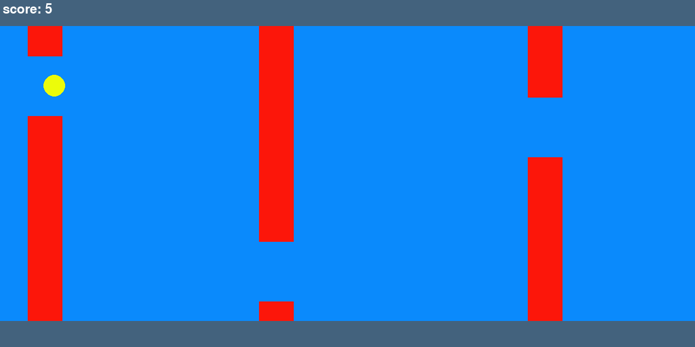

# endless_runner_nn



Simple endless runner game, player has to pass oncoming obstacles. Player only has one action, to jump. Program can be run in 4 modes:

### training
Trains simple Neural network to play the game.

### testing
Runs chosen model in real time.

### evaluation
Evaluates chosen model in multiple runs.

### playing
Allowes user to play the game manually. Use mouse click to jump.

Adjustable game parameters:

**--dens** - obstacle density, how many obstacles are on the screen.

**--gap** - size of the gap in the obstacles.

# Training process

An MlpPolicy from Stable-Baselines3 is used. Models were trained with decreasing obstacle gap, with the model trained on the higher gap used as a starting point for new training. Untrained model struggles to find random success in the beggining for obstacle density < 3. During training the game was limited to stop after the player passes 12 obstacles.

# Results


Satisfactory performance was achieved up to the gap sizes of 120 and 110. Model trained on 110 gap size performed better on 120 gap size obstacles than 120 gap size model, even though it performed very poorly on the gap size of 110. The evaluations run the game 100 times, with upper score limit of 100. All scenarios have relativly high standard deviations, sometimes reaching scores from 0 or 1 obstacles up to 100, showing poor consistency.

### 110 gap size model on 120 gap size obstacles
score
count  100.000000
mean    57.370000
std     38.510829
min      0.000000
25%     19.250000
50%     58.500000
75%    100.000000
max    100.000000

### 120 gap size model on 120 gap size obstacles

```
            score
count  100.000000
mean    42.410000
std     33.188198
min      1.000000
25%     15.000000
50%     33.500000
75%     74.000000
max    100.000000
```

### 110 gap size model on 110 gap size obstacles
```
           score
count  100.00000
mean     6.26000
std      5.79554
min      0.00000
25%      2.00000
50%      4.00000
75%      8.00000
max     30.00000
```


# Example training
```
python3 main.py --mode train --file dens_3_gap_120/best_model.zip --dens 3 --gap 120
```

# Example testing
```
python3 main.py --mode test --file dens_3_gap_120/best_model.zip --dens 3 --gap 120
```

# Example evaluation
```
python3 main.py --mode eval --file dens_3_gap_120/best_model.zip --dens 3 --gap 120
```

# Example playing
```
python3 main.py --mode play --dens 3 --gap 120
```